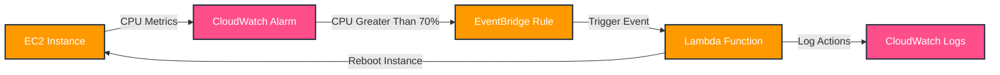
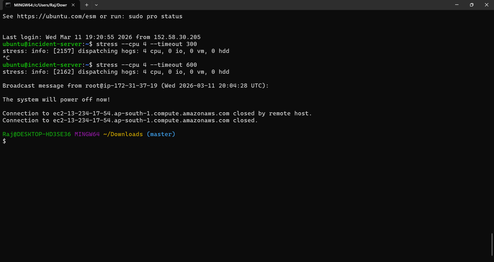
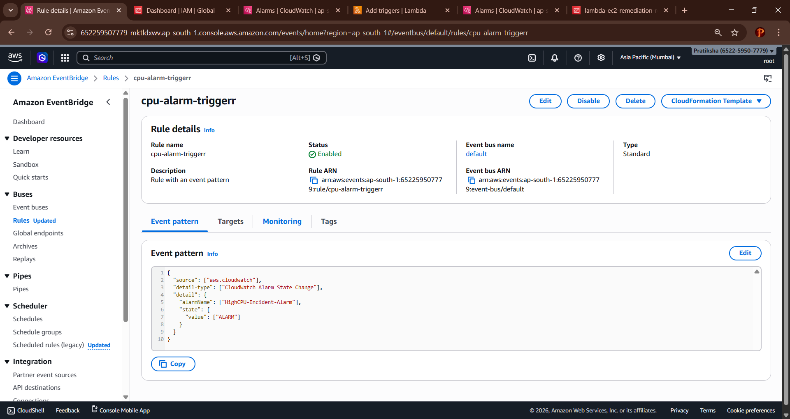
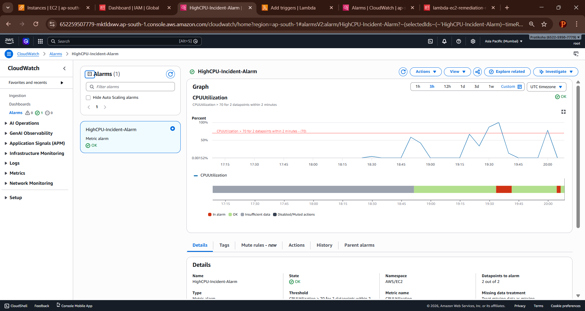
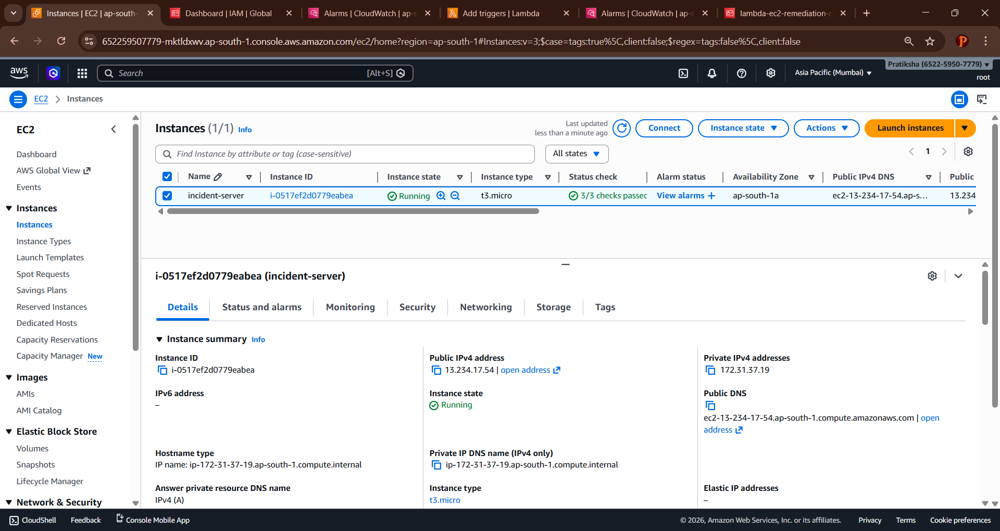
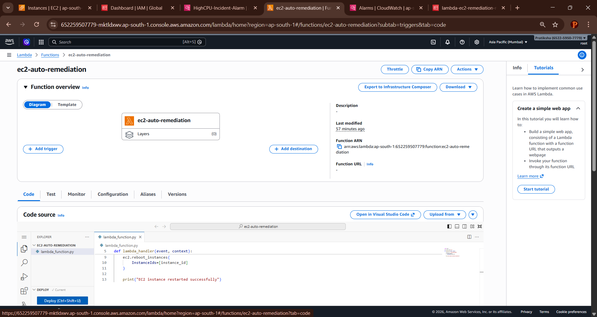
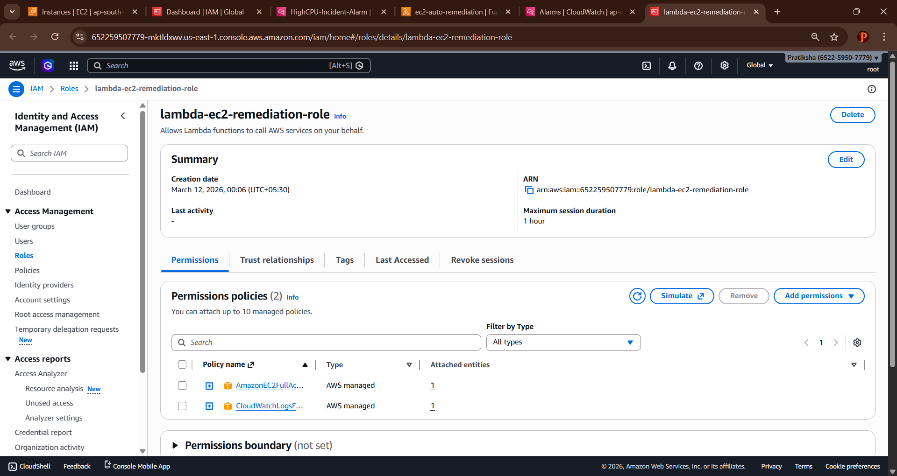
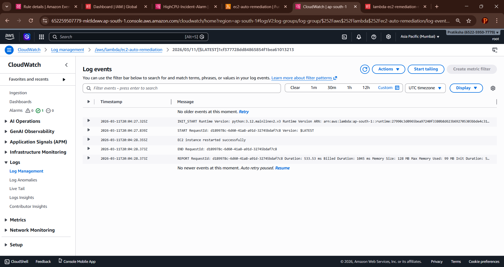

# AWS Automated Incident Response System

## Project Overview

An automated incident response system that monitors EC2 instances and triggers remediation actions when CPU utilization exceeds defined thresholds. This eliminates manual intervention and reduces downtime during production incidents.

## Problem Statement

**Scenario:** Production servers experienced downtime due to high CPU usage with no automated response mechanism.

**Solution:** Implement automated monitoring and remediation using CloudWatch Alarms and Lambda functions to restart affected EC2 instances automatically.

## Architecture



### Architecture Flow:
```
┌─────────────┐      ┌──────────────────┐      ┌─────────────────┐
│             │      │                  │      │                 │
│ EC2 Instance│─────▶│ CloudWatch Alarm │─────▶│ EventBridge Rule│
│             │      │  (CPU > 70%)     │      │                 │
└─────────────┘      └──────────────────┘      └─────────────────┘
       ▲                                                │
       │                                                │
       │                                                ▼
       │                                       ┌─────────────────┐
       │                                       │                 │
       └───────────────────────────────────────│ Lambda Function │
                  Reboot Instance              │  (Remediation)  │
                                               └─────────────────┘
                                                        │
                                                        │
                                                        ▼
                                               ┌─────────────────┐
                                               │                 │
                                               │ CloudWatch Logs │
                                               │  (Audit Trail)  │
                                               └─────────────────┘
```

## Components

### 1. **EC2 Instance**
- Target instance for monitoring
- Configured with CloudWatch detailed monitoring



### 2. **CloudWatch Alarm**
- Monitors CPU utilization metric
- Threshold: CPU > defined percentage
- State: OK → ALARM when threshold breached



### 3. **EventBridge Rule**
- Triggers on CloudWatch Alarm state change
- Routes alarm events to Lambda function



### 4. **Lambda Function**
- Automatically restarts EC2 instance
- Logs all remediation actions



### 5. **CloudWatch Logs**
- Records all remediation activities
- Provides audit trail



## Implementation Steps

### Step 1: Launch EC2 Instance
- Create EC2 instance with detailed monitoring enabled
- Note the Instance ID for Lambda configuration

### Step 2: Configure CloudWatch Alarm
```
Metric: CPUUtilization
Threshold: > 70% (configurable)
Period: 5 minutes
Evaluation: 1 datapoint
```

### Step 3: Create Lambda Function
- Runtime: Python 3.x
- Attach IAM role with permissions:
  - `ec2:RebootInstances`
  - `ec2:DescribeInstances`
  - `logs:CreateLogGroup`
  - `logs:CreateLogStream`
  - `logs:PutLogEvents`

### Step 4: Configure EventBridge Rule
- Event source: CloudWatch Alarms
- Target: Lambda function
- Event pattern: Alarm state change to ALARM

### Step 5: Testing
- Generate CPU load on EC2 instance
- Monitor alarm state transition
- Verify automated restart
- Check CloudWatch Logs

## Testing & Validation

### Alarm Triggered


### Remediation Success


## IAM Permissions Required

**Lambda Execution Role:**
```json
{
  "Version": "2012-10-17",
  "Statement": [
    {
      "Effect": "Allow",
      "Action": [
        "ec2:RebootInstances",
        "ec2:DescribeInstances"
      ],
      "Resource": "*"
    },
    {
      "Effect": "Allow",
      "Action": [
        "logs:CreateLogGroup",
        "logs:CreateLogStream",
        "logs:PutLogEvents"
      ],
      "Resource": "arn:aws:logs:*:*:*"
    }
  ]
}
```

## Incident Flow

1. **Detection:** EC2 CPU utilization exceeds threshold
2. **Alarm:** CloudWatch Alarm transitions to ALARM state
3. **Trigger:** EventBridge captures alarm event
4. **Remediation:** Lambda function restarts EC2 instance
5. **Logging:** Action logged to CloudWatch Logs
6. **Recovery:** Instance restarts, CPU normalizes
7. **Resolution:** Alarm returns to OK state

## Technologies Used

- **AWS EC2** - Compute instances
- **AWS CloudWatch** - Monitoring and alarms
- **AWS Lambda** - Serverless remediation
- **AWS EventBridge** - Event routing
- **Python** - Lambda function runtime

## Key Features

- Real-time monitoring
- Automated remediation
- Zero manual intervention
- Complete audit trail
- Scalable architecture
- Cost-effective solution

## Learning Outcomes

- CloudWatch alarm configuration
- Lambda function development
- EventBridge event routing
- IAM role and policy management
- Automated incident response workflows
- Infrastructure monitoring best practices

## Future Enhancements

- Auto Scaling Group integration
- SNS notifications for alerts
- Multi-region support
- Custom remediation actions based on alarm type
- Dashboard for incident tracking

## Author

**Raj**  
Cloud Operations Engineer Intern

---

*
